# ToFormy

ToFormy is an advanced application aimed at collecting and managing data, ideal for any organization or individual that needs a reliable solution for collecting information. Developed as a Progressive Web App (PWA), ToFormy works seamlessly across a variety of devices, offering robust functionality both online and offline.

### PREVIEW APP
[https://toformyapp.web.app](https://toformyapp.web.app)

## Main features

- **Custom Data Collection**: Create custom forms that fit exactly your data collection needs.
- **Database Storage**: The collected data is stored securely, facilitating access and management of information.
- **Offline Functionality**: ToFormy supports offline data collection.
- **Responsive Design**: The user interface is designed to work on any device, adapting perfectly to different screen sizes.
- **Data Export**: Export collected data to CSV, facilitating analysis and integration with other systems.

## Screenshots

### Mobile

| Screen 1 | Screen 2 | Screen 3 | Screen 4 |
| --- | --- | --- | --- |
| 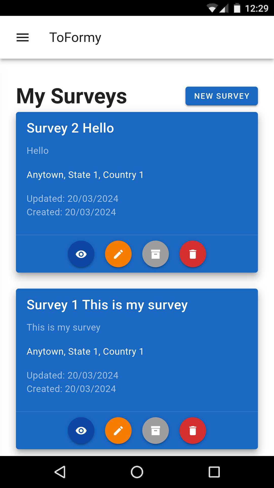 | 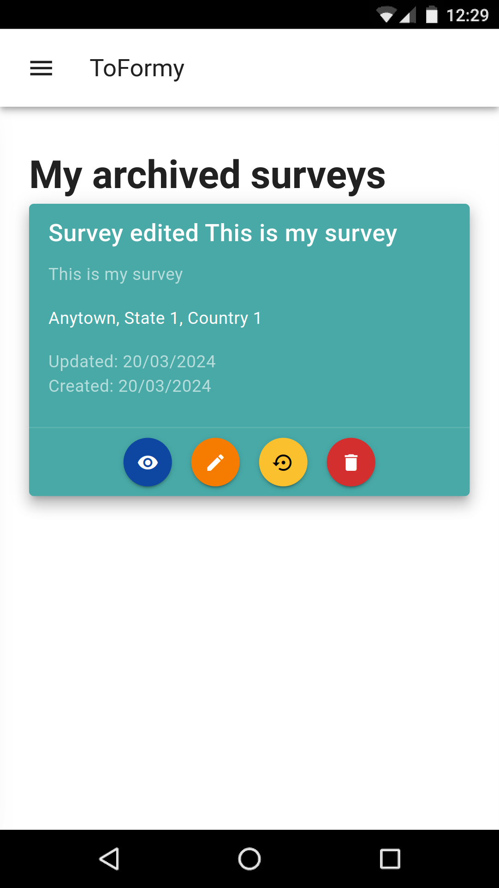 | 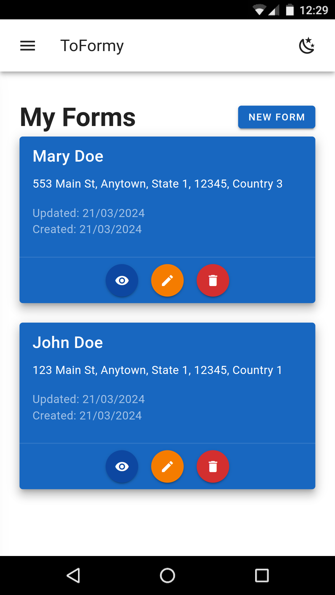 | 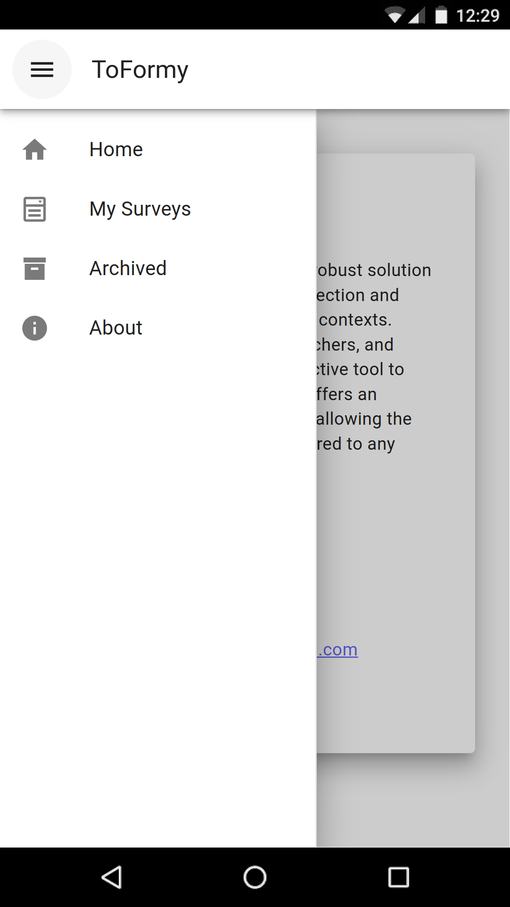 |

## How to begin

### Prerequisites

- Node.js (latest stable version recommended)
- NPM (Node Package Manager)

### Installation

1. Clone the ToFormy repository:

```bash
git clone https://github.com/MarioCarvalhoBr/ToFormy.git
cd ToFormy
```

2. Install project dependencies:

```bash
npm install
```

3. Start the development server:

```bash
npm run dev
```

After starting the server, you will be able to access ToFormy at `http://localhost:8080` (or the port indicated in the terminal).

## Usage

Use ToFormy to create your custom forms, collect data, and export it as needed.

## Contribution

Contributions to ToFormy are welcome! If you have ideas or suggestions to improve the app, feel free to fork the repository and submit a pull request.

## More Screenshots

### Mobile

| Screen 1 | Screen 2 | Screen 3 | Screen 4 |
| --- | --- | --- | --- |
| 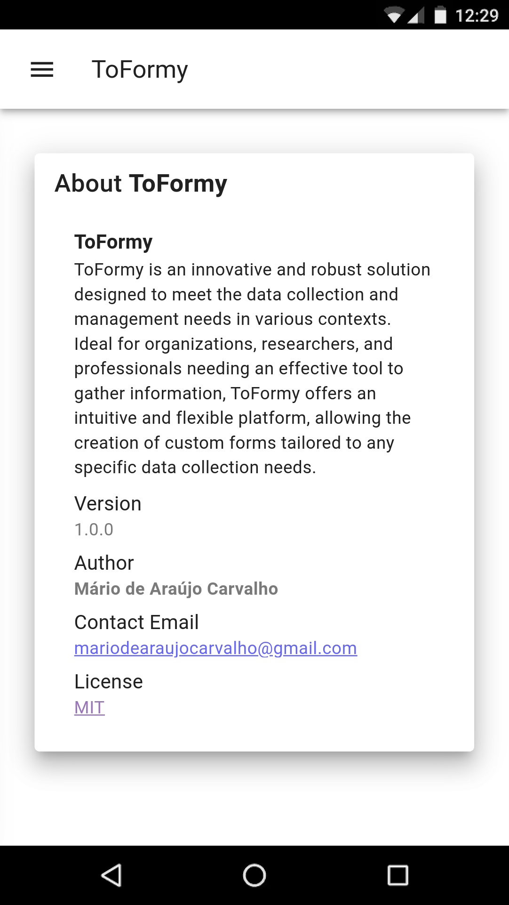 |  | 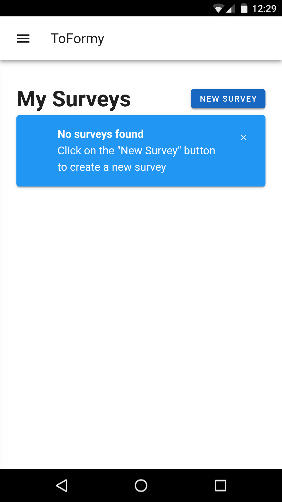 | 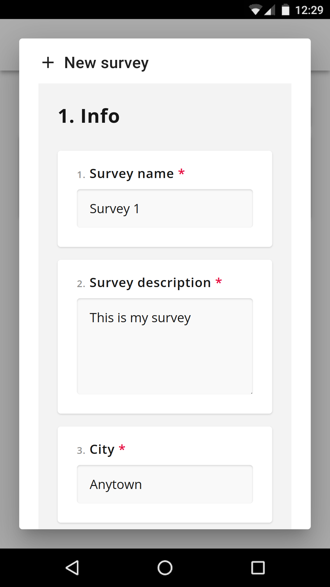 |
|  | 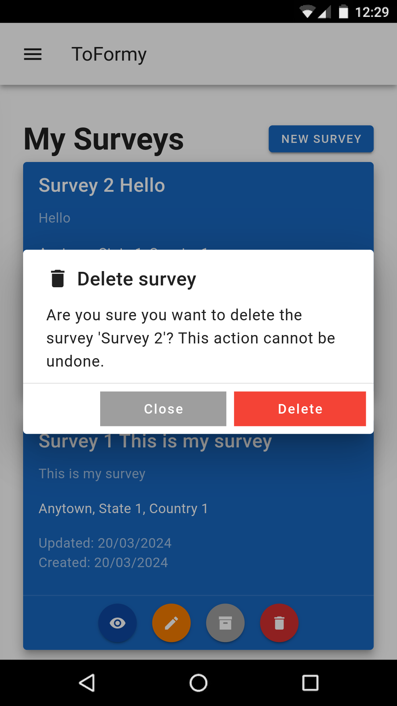 | 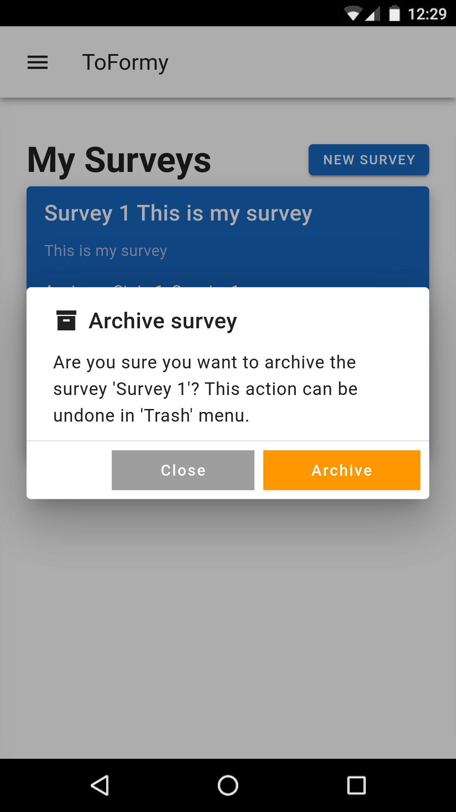 | 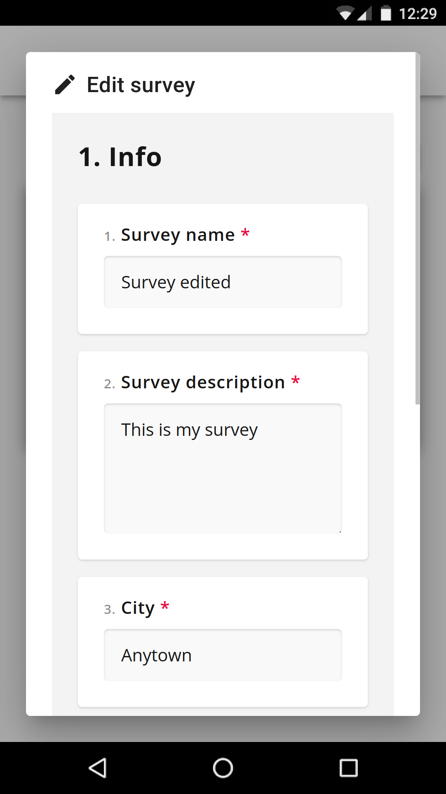 |
| 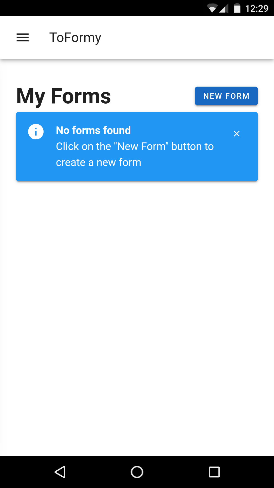 | 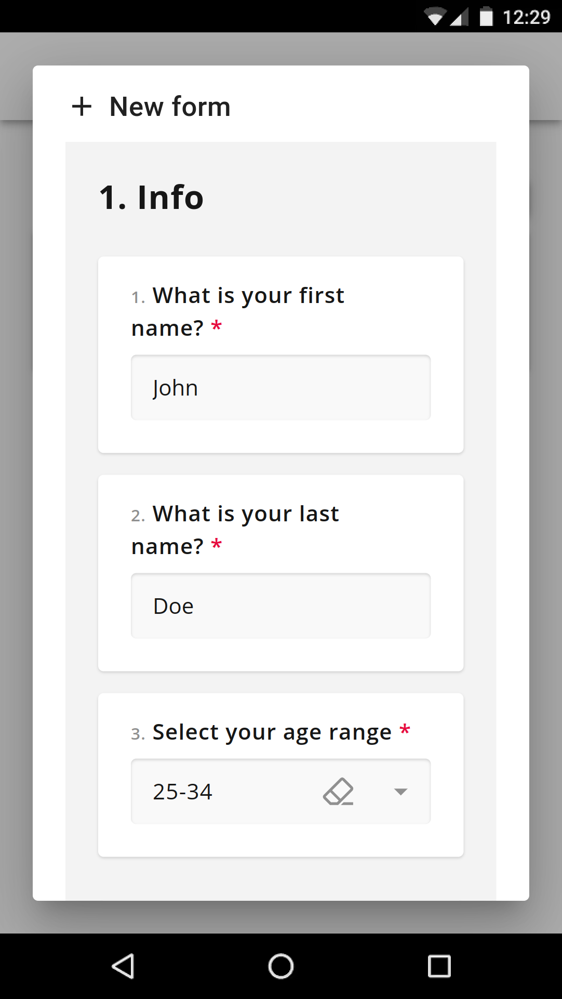 | 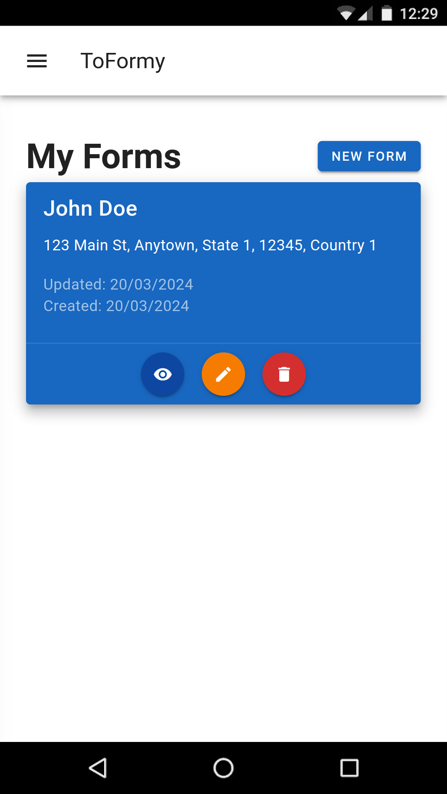 | 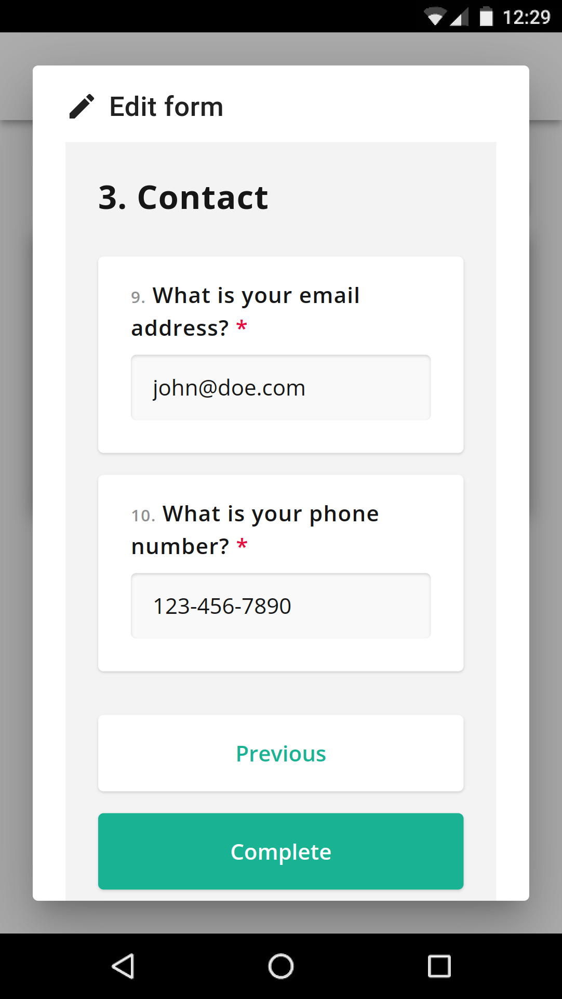 |

### Desktop

| Screen 1 | Screen 2 | Screen 3 | Screen 4 |
| --- | --- | --- | --- |
|  |  |  |  |


## Dark Mode Support
| Light Mode | Dark Mode |
| --- | --- |
|  | 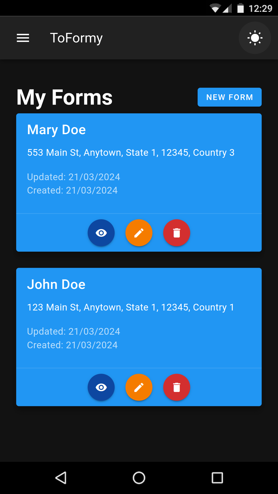 |

# Deploy
```bash
npm install -g firebase-tools
firebase login
firebase init
firebase deploy
```
## License

ToFormy is under the MIT License. See the [LICENSE](LICENSE) file for more details.

## Contact

- Author: Mário de Araújo Carvalho
- Email: mariodearaujocarvalho@gmail.com
- Project: [https://github.com/MarioCarvalhoBr/ToFormy](https://github.com/MarioCarvalhoBr/ToFormy)

---

Leverage ToFormy for your data collection needs!